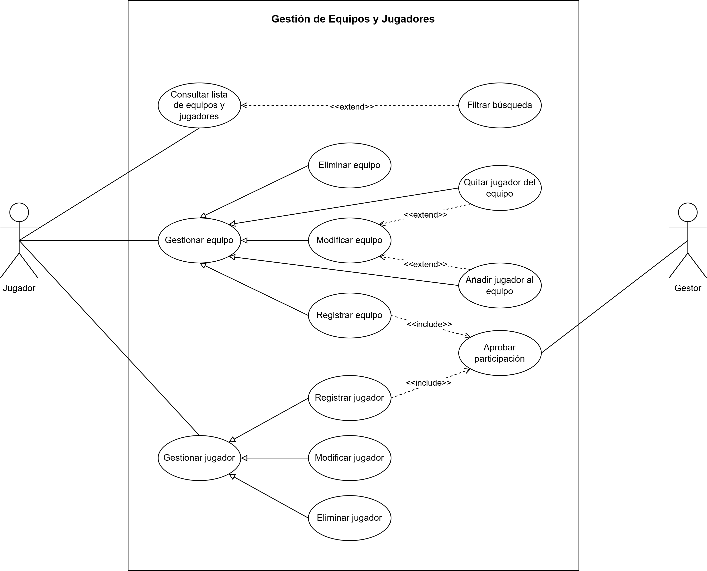
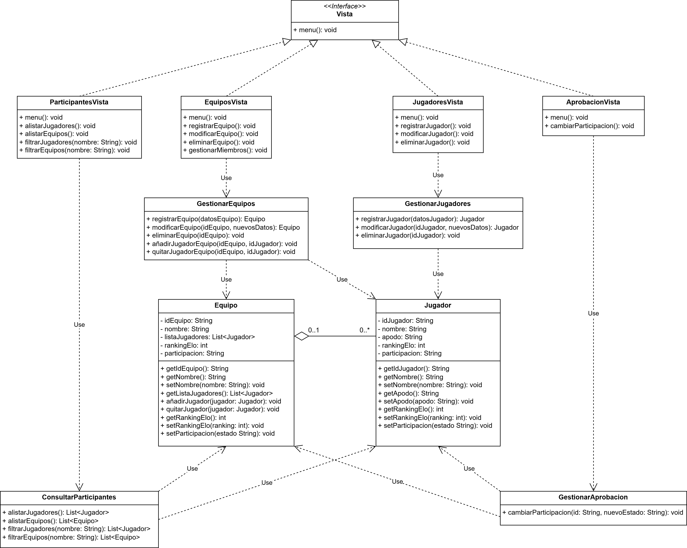

# Sistema de Gestión de Torneos de eSports

## Autor

Carlos Fu  

https://github.com/Estudiante-834  

## Descripción del Proyecto

https://github.com/Estudiante-834/torneo-esports-uml  

Tarea AD3 de EEDD en donde se modela parte de un sistema de gestión de torneos eSports mediante diagramas UML y se implementa en Java.  

## Diagramas UML  

### Diagrama de Casos de Uso  

  

### Diagrama de Clases  
  

## Estructura del Proyecto

torneo-esports-uml/  
├── src/  
│ ├── es/empresa/torneo/  
│ │ ├── modelo/  
│ │ ├── control/  
│ │ ├── vista/  
│ │ ├── Main.java  
├── diagrams/  
│ ├── casos-uso.png  
│ ├── clases.png  
├── README.md  
├── .gitignore  

## Instalación y Ejecución

1. Clonar el repositorio:  

`git clone https://github.com/Estudiante-834/torneo-esports-uml.git`  

2. Compilar y ejecutar el proyecto:  

`cd src javac es/empresa/torneo/Main.java java es.empresa.torneo.Main`  

## Justificación del diseño

Los diagramas mostrados en el proyecto son el resultado final tras varias versiones de experimentación y desarrollo, con cada versión profundizando más mi entendimiento sobre el modelado de diagramas de casos de uso y de clases.

Para este proyecto he elegido la "Gestión de equipos y jugadores". 

En el caso del diagrama de casos de uso, a partir de los puntos mencionados: "Registrar equipo, Añadir jugadores a un equipo, Consultar lista de equipos y jugadores", he podido sacar los actores principales, casos de uso relacionados y las relaciones asociadas entre dichos casos.

En cuanto los actores, he podido identificar los principales como "Jugador" y "Gestor" al darme cuenta que la "Gestión de equipos y jugadores" forman parte de un sistema más amplio, y al ver como toda interacción gira en torno a esta gestión de equipos y jugadores.

En segundo lugar, a partir de los puntos proporcionados de "registrar, añadir y consultar", he podido identificar posibles interacciones relacionadas con cada categoría:

- Registrar, Modificar, Eliminar tanto para la gestión de jugadores como para equipos.
- Añadir y Quitar jugadores en la gestión de equipos existentes.
- Filtrado de resultados para las consultas de jugadores y equipos.
- Interacción de "Aprobar Participación" para simular la tarea del actor gestor.

Todo esto teniendo en cuenta que el sistema en su totalidad es de "gestión de torneos eSports" en donde se considera una clara distinción entre jugadores y equipos, debido a los juegos de un solo jugador y los juegos multijugadores.

Las relaciones para los casos tipo CRUD son generalizaciones de los casos "gestionar" ya que son especializaciones de estas últimas. La aprobación de jugadores y equipos tienen relación `<<include>>` por su obligatoriedad para simular que solo participantes aprobados pueden participar en los torneos organizados.

Casos como el quitar y añadir distinto miembros de un equipo son de relación `<<extend>>` debido a que son opcionales para simular el cambio de miembros de un equipo como es habitual en los torneos de eSports. De igual manera, el caso de uso de filtro de consultas también es `<<extend>>` por ser opcional a la hora de buscar algún jugador o equipo específico en el sistema.

En el modelo de clases, se sigue una pauta Modelo, Vista y Controlador como indica los pasos de la tarea. 
Las clases principales se identifican como "Jugador" y "Equipo" al ser estos los datos principales el cual la "Gestión de equipos y jugadores" manipula en el diagrama de casos. 

No se eligió ninguna estructura en particular, la estructura presentada es más bien el resultado de varios experimentos y tras reconocer que el modelo de casos de uso modela comportamientos del sistema. Esto nos da pistas sobre los actores que interactúan con el sistema y las acciones resultantes de dichas interacciones. 

Todo esto culmina nítidamente en la creación y clasificación de clases tipo MVC a partir del diagrama inicial de casos de uso en donde:

- Los actores en el diagrama de casos pasan a ser las vistas en el diagrama de clases.
- Los comportamientos o acciones que modela el diagrama de casos pasan a ser los controladores.
- Los datos principales donde las acciones de los casos de uso actúan sobre (pero que no están representadas en el diagrama) pasan a ser los modelos en el diagrama de clases.

Sabiendo esto, el diagrama de clases pasa a organizarse con vistas como las clases interfaz abstraída de lógica, en donde los actores las utlizan para realizar acciones en el sistema. Estas clases son "JugadoresVista", "EquiposVista", "ParticipantesVista" y "AprobacionVista". Se abstrae una `<<interface>>` "Vista" general para representar un método `menu()` que tendrán todas las otras subclases tipo vistas que implementen la interfaz. Los controladores, en donde se alojan el grueso de la lógica del sistema, se utiliza para manipular los datos principales del sistema. Estas clases son las de gestión, consulta y aprobación. Finalmente, tenemos los modelos, que son las clases principales del sistema como "Jugador" y "Equipo" donde contienen información de los distintos jugadores y equipos.

Para las relaciones en el diagrama de clases, toda subclase vista tiene una relación de realización con la clase `<<interface>>` "Vista". Relación de dependencia de "uso" ocurre entre las clases vistas, controlador y modelo, ya que cada clase utiliza a la otra al llamar sus métodos. Por último, entre la clase "Jugador" y "Equipo" existe una relación de agregación porque un equipo puede agrupar jugadores pero jugadores pueden existir por sí sin equipos. Esto nos lleva a que dicha relación tenga cardinalidad `0..1` y `0..*`. Un jugador puede pertenecer a uno o a ningún equipo y cada equipo puede tener a varios o ningún jugador.

## Conclusiones  

A pesar de la dificultad de la tarea, aprender modelado es siempre beneficioso ya que nos fuerza y enseña a pensar en abstracciones y generalizaciones. Esto nos permite simplificar, modularizar y jerarquizar nuestro código. Dándonos una nueva perspectiva para pensar sobre la programación más allá de la sintáxis o de una simple secuencia de instrucciones.

En esta actividad en concreto, partiendo de las acciones del "qué hace" y "quién" desde el diagrama de casos de uso, resultó ser útil para luego saber el "cómo" en la fase de creación de clases e implementación del código. Separando las clases en un modelo como el MVC con sus relaciones da a conocer la posibilidad de separar distintas tareas y responsabilidades en distintas capas dentro de un mismo sistema.

En definitiva, pensar y modelar con anterioridad ayuda a agilizar el proceso de codificación.
